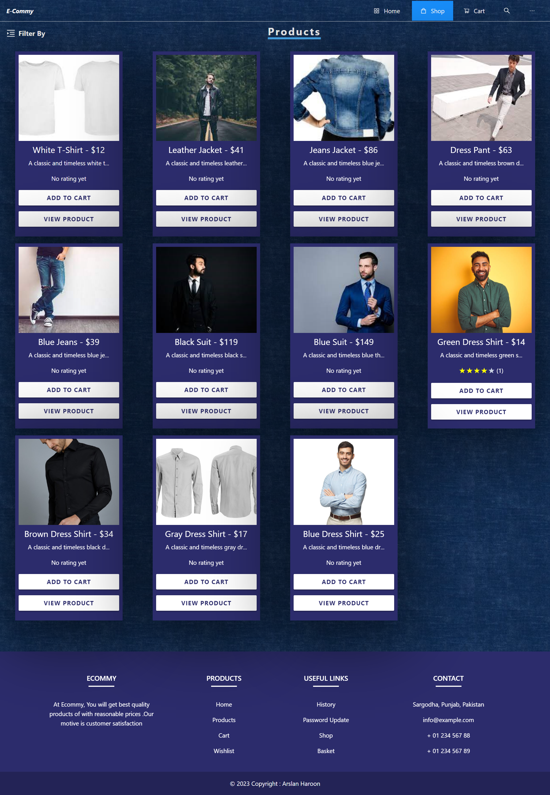
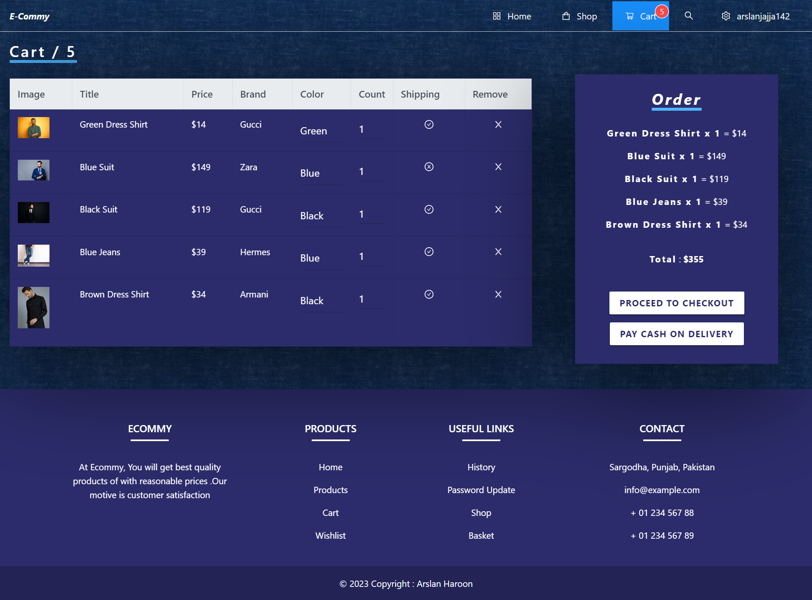
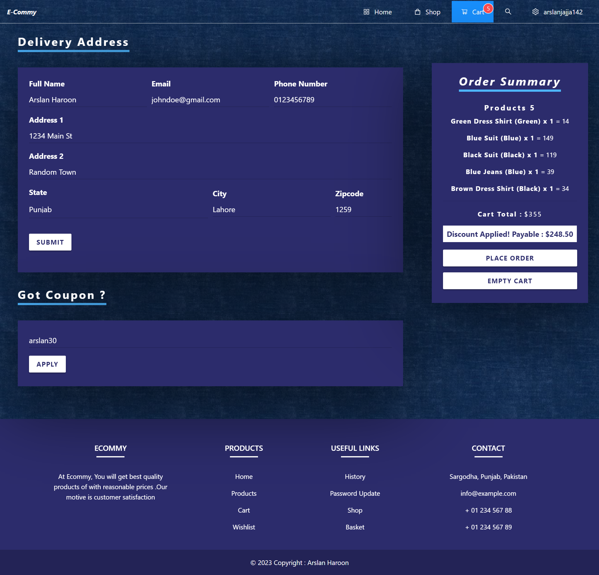
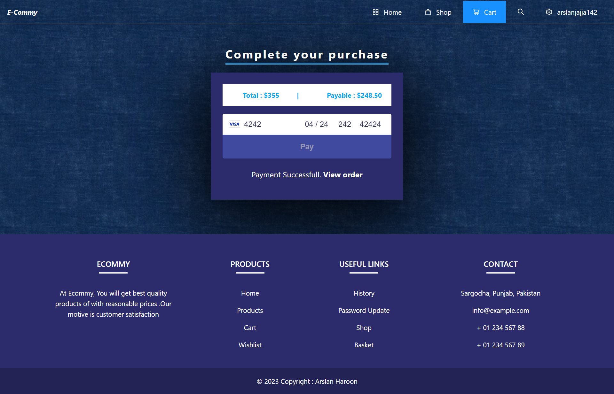

# MERN Stack eCommerce Project

This MERN stack eCommerce project is a comprehensive web application that provides a complete solution for online shopping. It offers a wide range of features including user authentication, product management, advanced search options, cart functionality, payment integration, and more.

## Pages

### Home Page

### Shop Page 

### Shopping Cart Page

### Checkout Page

### Payment Page

### User Order Tracking Page

## Features

- Login Registration System:
  - Users can register and log in using their email and password.
  - Social login with Google authentication is also available.

- Admin Dashboard and Order Management System:
  - An admin dashboard allows for easy management of products, orders, and users.
  - Order management system enables efficient order tracking and processing.

- Products CRUD with Advanced Features:
  - Full CRUD (Create, Read, Update, Delete) functionality for managing products.
  - Support for categories, sub-categories, and multiple image uploads.
  - Product details include descriptions, pricing, and stock availability.

- Advanced Searching and Filtering:
  - Plenty of advanced searching and filtering options to help users find desired products quickly.
  - Search by keywords, categories, price range, and more.

- Star Rating System:
  - Users can rate and provide feedback on products using a star rating system.

- Cart Functionality:
  - Users can add products to their cart, view cart contents, and update quantities.
  - Cart functionality is implemented on both the frontend and backend.

- Checkout with Payment Integration:
  - Secure checkout process with payment integration using Stripe for credit card payments.
  - Cash on delivery option available for users who prefer offline payment.

- User Dashboard:
  - User dashboard provides features such as password update, purchase history, and invoice/PDF downloads.

- Deployment:
  - The application can be easily deployed on Heroku for live production use.

## Installation and Usage

1. Clone the repository:
git clone https://github.com/ArslanJajja1/Full-stack-ecommerce-web-app.git

2. Install dependencies:
cd repo-name
npm install

3. Set up environment variables:
- Rename the `.env.example` file to `.env`.
- Update the necessary configuration values in the `.env` file.

4. Start the development server:
npm start

5. Open your browser and access the application at `http://localhost:3000`.

## Contribution

Contributions to this project are welcome. If you encounter any issues or have suggestions for improvement, please create a new issue or submit a pull request.

## License

This project is licensed under the [MIT License](https://opensource.org/licenses/MIT).

